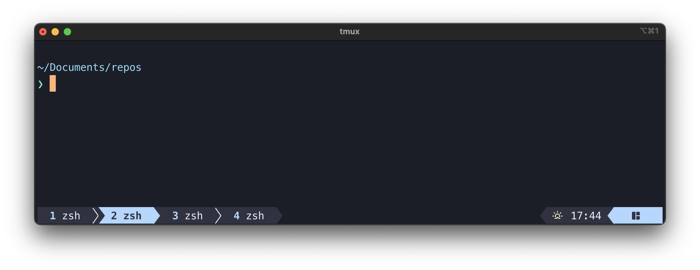
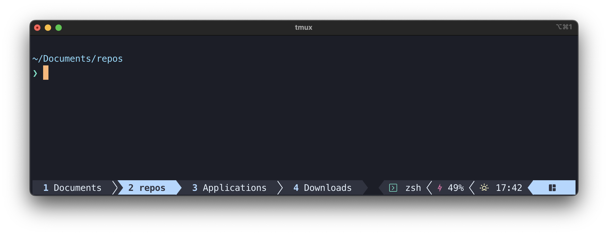
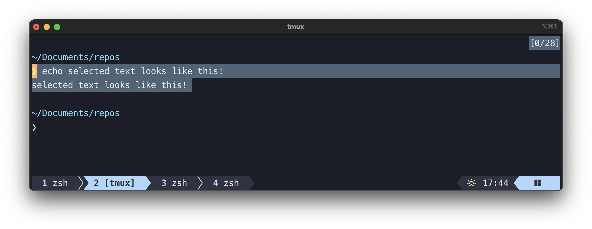

A tmux plugin which styles tmux to my liking, work on which was started before I learned that [tmux-powerline](https://github.com/erikw/tmux-powerline) is a (most excellent) thing. Uses (mostly) colours from the lovely [Poimandres theme](https://github.com/drcmda/poimandres-theme).

By default, the plugin should make the tmux status line look like this:



Or with all options enabled (see below for details on configuration):



The plugin also sets the colours used when selecting text:



## Requirements

- tmux 3.2 or newer (tested with 3.5a)
- Bash 3.2+
- a [Nerd Font](https://www.nerdfonts.com/) installed and enabled in your terminal
- *macOS* (if you want to enable the battery charge indicator; required for `pmset`, everything else in the plugin should be portable)

## Installation

1. Install [tpm](https://github.com/tmux-plugins/tpm) if not already installed
2. Add the following line to `tmux.conf`:
      ```conf
       set -g @plugin 'Don-L/dons-tmux-theme'
      ```
3. Install the plugin with (by default) `<prefix>I`

## Configuration

To enable the battery charge indicator (*macOS* only) in status-right, add the following line to `tmux.conf`:
```conf
set -g @dons_tmux_show_battery "on"
```

To show the name of the active application in status-right, add this:
```conf
set -g @dons_tmux_show_app "on"
```

To display directory names instead of window names in the status line add this:
```conf
set -g @dons_tmux_use_directory "on"
```

## Acknowledgements

- The features in this plugin were largely inspired by those present in catppuccin's awesome tmux [themes](https://github.com/catppuccin/tmux)
- Thank you to the creators and maintainers of tmux, and the wider tmux community
- Thank you to all the devs whose work enabled my LLM of choice to help me create this

